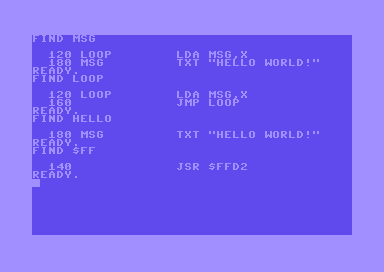
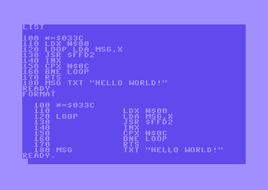
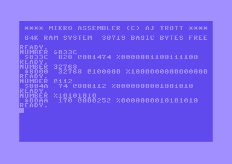
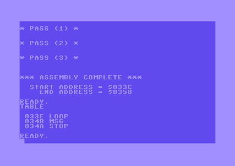

# Mikro Assembler BASIC Commands

Below is a list of commands that can be used with Mikro Assembler, along with their descriptions and examples. These commands can also be invoked using BASIC shortcuts by entering the first letter and holding shift while entering the second letter.

 - [ASSEMBLE](#assemble) - assemble the source code
 - [AUTO](#auto) - automatically provide line numbers
 - [DELETE](#delete) - remove specified lines
 - [DISASSEMBLE](#disassemble) - display a disassembled area of memory
 - [FIND](#find) - display lines containing some text
 - [FORMAT](#format) - display the formatted source code
 - [NUMBER](#number) - display a number in different formats
 - [TABLE](#table) - display a list of assembled labels
 - [TIM](#tim) - start the machine code monitor

## ASSEMBLE

### Commands
* `ASSEMBLE`

### Description
The `ASSEMBLE` command assembles the source code into memory by running three passes, and provides addresses for the start and end of each area of memory used. If the assembly would corrupt the area of memory that contains BASIC code, it prompts for confirmation or stops and displays an error.

## AUTO

### Commands
* `AUTO`
* `AUTO start`
* `AUTO start,step`

### Description
The `AUTO` command outputs a line number ready for code to be entered, and automatically displays the next line number when you press return. To stop the `AUTO` function, hold shift and press return or press return twice. The default start number is 100, and the default step is 10 on the first run.

## DELETE

### Commands
* `DELETE start-end`
* `DELETE start-`
* `DELETE -end`

### Description
The `DELETE` command removes the specified range of lines from memory.

## DISASSEMBLE

### Commands
* `DISASSEMBLE start-end`
* `DISASSEMBLE start-`

### Description
The `DISASSEMBLE` command displays a listing of memory locations and their contents, along with the corresponding opcodes or "BYT" if the opcode is invalid. If more than a screenful of information is available, the command pauses until you press a key.

## FIND

### Commands
* `FIND text`
* `FIND text,start-end`
* `FIND text,start-`
* `FIND text,-end`

### Description
The `FIND` command displays a formatted list of lines containing the specified text. You can limit the output to a specified range.

## FORMAT

### Commands
* `FORMAT`
* `FORMAT start-end`
* `FORMAT start-`
* `FORMAT -end`

### Description
The `FORMAT` command displays the source code formatted in columns better suited for displaying assembler code.

## NUMBER

### Commands
* `NUMBER $hexadecimal`
* `NUMBER decimal`
* `NUMBER @octal`
* `NUMBER %binary`
* `NUMBER label`

### Description
The `NUMBER` command takes a number, or an assembled label, and displays its value in hexadecimal, decimal, octal, and binary. It can also display the result of simple additions and subtractions as long as the value is not negative at any stage of the calculation.

## TABLE

### Commands
* `TABLE`

### Description
The `TABLE` command displays an alphabetically sorted list of labels with their 16-bit hexadecimal values after a successful assemble.

## TIM

### Commands
* `TIM`

### Description
The `TIM` command starts the machine code monitor and puts you at the prompt, ready for input. It displays the starting address of `TIM` and the state of the registers.
