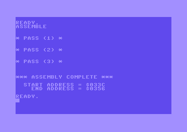
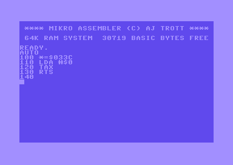
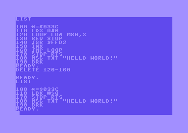
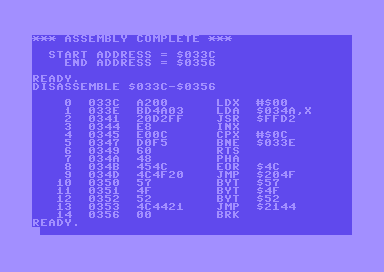

# Mikro Assembler BASIC Commands

 - [ASSEMBLE](#assemble) - assemble the source code
 - [AUTO](#auto) - automatically provide line numbers
 - [DELETE](#delete) - remove specified lines
 - [DISASSEMBLE](#disassemble) - display a disassembled area of memory
 - [FIND](#find) - display lines containing some text
 - [FORMAT](#format) - display the formatted source code
 - [NUMBER](#number) - display a number in different formats
 - [TABLE](#table) - display a list of assembled labels
 - [TIM](#tim) - start the machine code monitor

## ASSEMBLE

### Commands
* `ASSEMBLE`

### Description
Assemble the source code to memory. It runs three passes then provides addresses for the start and end of each area of memory used, or stops and displays an error.

## AUTO

### Commands
* `AUTO`
* `AUTO start`
* `AUTO start,step`

### Description
Output a line number ready for code to be entered, then automatically displays the next line number when you press return.

To stop the AUTO function hold shift and press return, or press return twice. 

On the first run the default start number is 100. The default step is 10.

## DELETE

### Commands
* `DELETE start-end`
* `DELETE start-`
* `DELETE -end`

### Description
Delete the specified range of lines from memory.

## DISASSEMBLE

### Commands
* `DISASSEMBLE start-end`
* `DISASSEMBLE start-`

### Description
Displays a listing of memory locations and their contents, along with the corresponding opcodes or BYT if the opcode is invalid. If more than a screenful of information it pauses until you press a key.

## FIND

### Commands
* `FIND text`
* `FIND text,start-end`
* `FIND text,start-`
* `FIND text,-end`

### Description
Display a formatted list of lines containing the specified text. Can be limited to a specified range.

## FORMAT

### Commands
* `FORMAT`

### Description
Display the source code formatted in columns better suited for assembler code.

## NUMBER

### Commands
* `NUMBER $hexadecimal`
* `NUMBER decimal`
* `NUMBER @octal`
* `NUMBER %binary`
* `NUMBER label`

### Description
Take a number, or an assembled label, and display its value in hexadecimal, decimal, octal, and binary.

It can also display the result of simple additions and subtractions, as long as the value is not negative at any stage of the calculation.

## TABLE

### Commands
* `TABLE`

### Description
Used after a successful assembly to display an alphabetically sorted list of labels with their 16-bit hexadecimal values.

## TIM

### Commands
* `TIM`

### Description
Start the machine code monitor and put you at the prompt, ready for input. It displays the starting address of TIM and the state of the registers.
