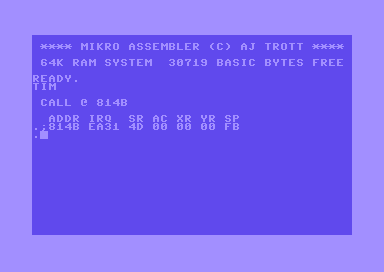

# Mikro Assembler Machine Code Monitor

To enter the machine code monitor type `TIM` at the basic prompt.

## D (Disassemble)

### Command
* `D <start address> <end address>`

### Description
The `D` command is used to disassemble machine code instructions. It allows you to view the assembly instructions corresponding to a range of memory addresses.

To use this command, provide the start and end addresses of the memory range you want to disassemble. For example, `D C000 C100` would disassemble the machine code instructions between memory addresses `C000` and `C100`.

## G (Go execute)

## H (Hunt)

### Command
* `H <start address> <end address> <byte> [<byte>]...`

### Description
The `H` command is used to search for specific bytes in memory. It lists all addresses in the given range that contain the specified byte pattern.

To use this command, provide the start and end addresses of the memory range to search within, followed by the byte or bytes you want to find. For example, `H C000 D000 BB` would search for occurrences of the byte `BB` in the memory range between addresses `C000` and `D000`.

You can also search for multiple bytes by providing additional bytes separated by spaces. For example, `H C000 D000 12 34 AB` would search for occurrences of the byte pattern `12 34 AB` in the specified memory range.

## L (Load)

### Command
* `L ["<filename>"[,<drive>]]`

### Description
The `L` command is used to load machine code into memory from a file.

To use this command, provide the filename of the binary file you want to load and a two digit drive number. For example, `L "PROGRAM.PRG",08` would load the machine code from the file "PROGRAM.PRG" into memory from drive 8.

To load from cassette you can omit the drive number or use drive 01. If you also omit the filename it will load the first program from tape.

## M (Memory display)

### Command
* `M <start address> <end address>`

### Description
The M command displays the contents of memory, allowing you to view and edit the values stored at specific addresses. You can overwrite values and press return on the line to save the changes.

To use this command, provide the start and end addresses of the memory range you want to display. For example, `M C000 C100` would display the memory contents between addresses `C000` and `C100`.

## R (Register display)

### Command
* `R`

### Description
The `R` command displays the values of the CPU registers, allowing you to view and edit their current state

To use this command, simply enter `R` and the register values will be displayed on the screen. You can overwrite a value and press return to save the changes.

## S (Save)

### Command
* `S "[<logical file number>:]<filename>",<drive>,<start address>,<end address>`

### Description
The `S` command is used to save a range of memory to a file. It allows you to specify the filename, drive, and memory range for the save operation.

To use this command, provide the following parameters:

* `"[<logical file number>:]<filename>"`: Specify the filename in quotes and optionally include the logical file number (default is 0). For example, `"0:PROGRAM.PRG"` specifies the filename as "PROGRAM.PRG" and the logical file number as 0.
* `<drive>`: Specify the drive number using two digits. For example, `08` represents the first disk drive, `01` represents the cassette.
* `<start address>`: Specify the start address of the memory range to save.
* `<end address>`: Specify the end address of the memory range to save.

For example, `S "0:PROGRAM.PRG",08,C000,C100` would save the memory contents between addresses `C000` and `C100` to the file "PROGRAM.PRG" on drive 8.

## T (Transfer)

## X (Exit to Basic)

### Command
* `X`

### Description
The `X` command is used to exit the machine code monitor and return to the BASIC prompt.

To use this command, simply enter `X`.
