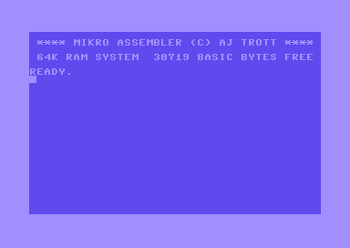

# Mikro Assembler

## Introduction

The Mikro Assembler is a cartridge released by Supersoft for the Commodore 64/VIC 20 in the early 1980s. It was written by and is copyright Andrew J Trott.

The Mikro Assembler allows you to write assembly code in the same way as BASIC code. You enter it to the BASIC interpreter using line numbers and can `LOAD`, `SAVE` and `VERIFY` the code to disk or tape.

It provides a machine code monitor called `TIM`.

## Usage

* [List of BASIC Commands](Basic%20Commands.md)

## Examples

* [Hello World](examples/helloworld.md)
